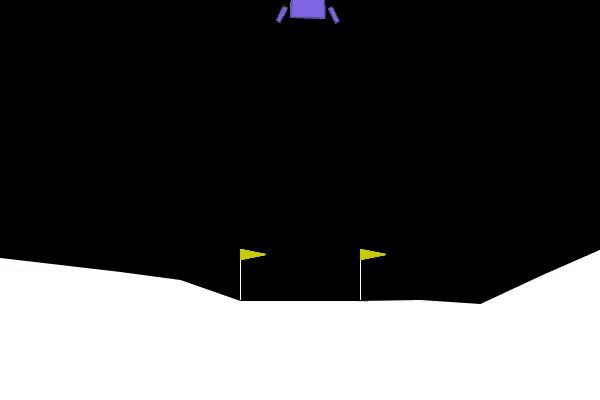

## DDPG - Lunar Lander

The DDPG algorithm is a variant of the [Q-learning algorithm](https://en.wikipedia.org/wiki/Q-learning). It is a method that can be used to  solve the [Lunar Lander](https://en.wikipedia.org/wiki/Lunar_Lander) problem when it has a continuous action space.

Such a problem is implemented with the OpenAI Gym [LunarLander-v2](https://www.gymlibrary.ml/environments/box2d/lunar_lander/). The Lunar Lander is a 2D game where the player must land the spacecraft on the ground. The game is played on a flat surface. The player can control the spacecraft by pressing the left and right arrow keys. The player can also accelerate the spacecraft by pressing the up arrow key. The player can also rotate the spacecraft by pressing the down arrow key.

In this exercise, we just want to train a DDPG agent to play the Lunar Lander game. The parameters are the same than the ones used in the DDPG paper [Dueling Deep Q-Network Algorithms for](https://arxiv.org/abs/1511.06581).

## Current results :

